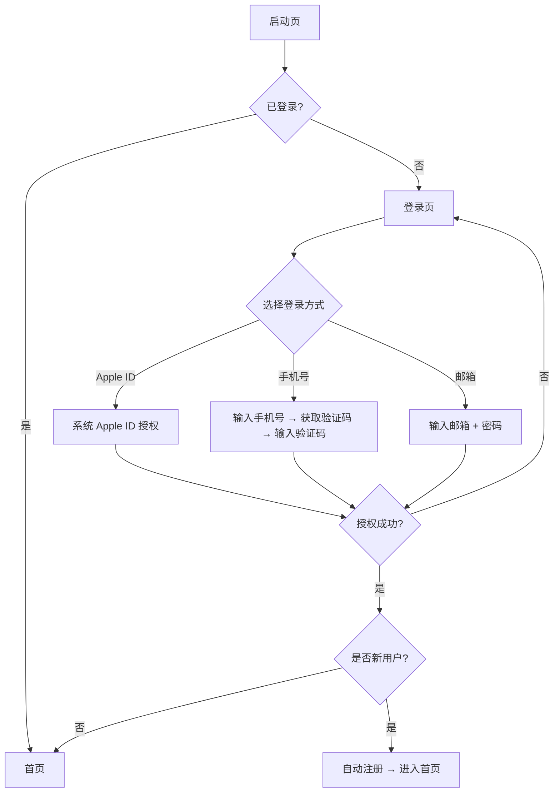
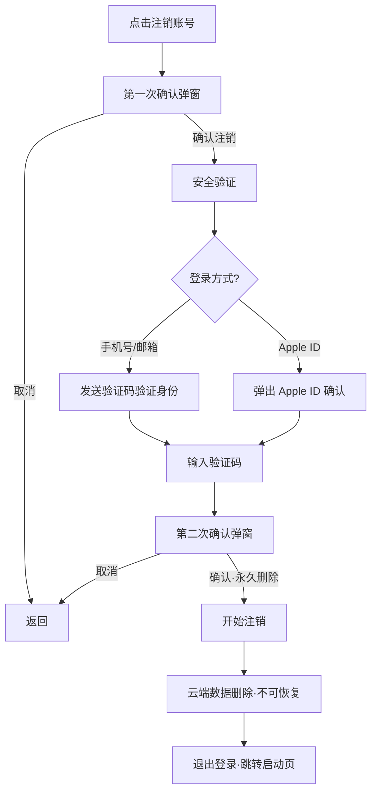
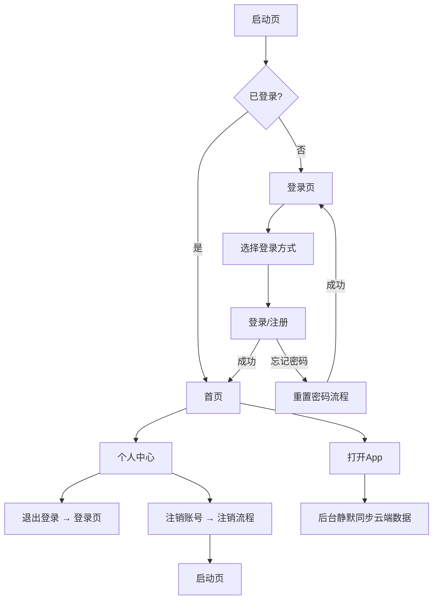

# 睡眠音响 PRD v10 - 账号体系

> 版本：v10 | 日期：2026-06-10 | 阶段：D 模块细化 | 模块：账号体系

---

## 账号体系 · 功能描述

### 页面定位

账号体系是 App 的基础设施，覆盖登录、注册、安全、数据同步全流程。用户可选择手机号、邮箱、Apple ID 三种方式登录，数据通过云端在多设备间同步。

### 核心原则

*   **登录态不过期**：一次登录，永久有效，除非用户主动退出或注销
*   **数据与账号强绑定**：云端数据归账号所有，退出保留本地，注销删除云端
*   **登录即注册**：新用户首次登录自动创建账号，无需独立注册流程

---

## 一、登录/注册

### 支持的登录方式

| 平台 | 登录方式 | 优先级 | 说明 |
|------|----------|--------|------|
| **iOS** | Apple ID | P0 | 一键登录，无需额外操作 |
| **全平台** | 手机号 + 验证码 | P1 | 支持国内外手机号 |
| **全平台** | 邮箱 + 密码 | P1 | 传统登录方式 |

### 登录页布局

```
┌─────────────────────────────┐
│                             │
│   [品牌 Logo]               │
│   睡眠音响                   │
│   记录每一个好梦             │
│                             │
├─────────────────────────────┤
│                             │
│   ┌─────────────────────┐   │
│   │ 🍎 通过 Apple 登录   │   │  ← iOS 平台显示
│   └─────────────────────┘   │
│                             │
│   ─────── 或 ───────        │
│                             │
│   ┌─────────────────────┐   │
│   │ 📱 手机号登录        │   │
│   └─────────────────────┘   │
│   ┌─────────────────────┐   │
│   │ ✉️  邮箱登录          │   │
│   └─────────────────────┘   │
│                             │
├─────────────────────────────┤
│  登录即表示同意              │
│  《用户协议》和《隐私政策》   │
│                             │
└─────────────────────────────┘
```

### 登录流程



### 手机号登录详细流程（分步式）

手机号登录拆分为两个独立页面，分步完成，降低认知负担。

**步骤一：输入手机号（W2Xy0V）**

| 元素 | 内容 |
|------|------|
| 导航 | `< 返回` — 回到登录主页 |
| 标题 | "手机号登录" |
| 副标题 | "输入手机号，获取验证码即可登录" |
| 区号选择器 | +86 ▼ — 默认中国区号，点击展开国家/地区列表 |
| 手机号输入框 | placeholder:"请输入手机号" |
| 主按钮 | "获取验证码" — 品牌色填充按钮，点击后进入步骤二 |

**步骤二：输入验证码（i4746）**

| 元素 | 内容 |
|------|------|
| 步骤指示器 | ● ● — 两个圆点，当前在第2步高亮(品牌色) |
| 导航 | `< 返回` — 回到步骤一 |
| 标题 | "输入验证码" |
| 副标题 | "验证码已发送至 +86 138****1234" — 脱敏显示手机号 |
| 验证码输入 | 6 个独立输入框，每框 1 位数字，自动跳转焦点 |
| 倒计时 | "重新发送 (58s)" — 60 秒后可点击重发 |
| 底部提示 | "验证通过后将自动登录" — 居中淡色文字 |

**交互细节：**

```
步骤一                     步骤二
┌──────────────────┐      ┌──────────────────┐
│ < 返回           │      │ ● ○              │ ← 步骤指示
│                  │      │ < 返回           │
│ 手机号登录        │      │                  │
│ 输入手机号...     │      │ 输入验证码        │
│                  │      │ 已发送至 +86 138**│
│ ┌───┐ ┌──────┐  │      │                  │
│ │+86│ │请输入 │  │      │ ┌─┐┌─┐┌─┐┌─┐┌─┐┌─┐│
│ │ ▼ │ │手机号 │  │      │ │3││8││ ││ ││ ││ ││ ← 6位
│ └───┘ └──────┘  │      │ └─┘└─┘└─┘└─┘└─┘└─┘│
│                  │      │                  │
│ ┌──────────────┐ │      │ 重新发送 (42s)    │
│ │ 获取验证码    │ │      │                  │
│ └──────────────┘ │      │ 验证通过后自动登录  │
└──────────────────┘      └──────────────────┘

### 邮箱登录详细流程

| 步骤 | 操作 | 界面 | 说明 |
|------|------|------|------|
| 1 | 输入邮箱 | 邮箱输入框 | 格式校验 |
| 2 | 输入密码 | 密码输入框（密文） | 8-32位，至少含字母+数字 |
| 3 | 点击登录 | loading 状态 | 验证邮箱+密码 |
| 4 | 验证通过 | 自动登录 → 跳转首页 | 新用户自动注册 |

### 第三方登录注意事项

| 项目 | 说明 |
|------|------|
| **用户信息获取** | 从 Apple ID 获取头像、昵称、邮箱（仅首次登录时） |
| **信息冲突处理** | 如第三方信息不可用，使用默认头像 + "睡眠用户_xxxx" 昵称 |
| **绑定提示** | 第三方登录后，设置页提示"建议绑定手机号/邮箱，防止第三方服务不可用时无法登录" |

---

## 二、忘记密码

### 触发场景

*   邮箱+密码登录时，点击"忘记密码？"
*   设置页手动点击"修改密码"

### 流程（三步骤）

忘记密码拆分为三个独立页面，逐步引导用户完成重置。

**步骤一：输入邮箱（EogJX）**

| 元素 | 内容 |
|------|------|
| 步骤指示器 | ● ○ ○ — 三圆点，当前第1步(#21DBB0) |
| 导航 | `< 返回` — 回到邮箱登录页 |
| 标题 | "忘记密码" |
| 副标题 | "步骤 1/3 · 输入注册邮箱" |
| 邮箱输入框 | placeholder:"请输入注册邮箱" |
| 主按钮 | "下一步" — 品牌色填充 |

**步骤二：安全验证（XNJJq）**

| 元素 | 内容 |
|------|------|
| 步骤指示器 | ● ● ○ — 当前第2步 |
| 导航 | `< 返回` — 回到步骤一 |
| 标题 | "安全验证" |
| 副标题 | "步骤 2/3 · 验证码已发送至邮箱" |
| 验证码输入 | 6 个独立输入框，每框 1 位 |
| 倒计时 | "重新发送 (48s)" |
| 主按钮 | "下一步" — 品牌色填充 |

**步骤三：设置新密码（z0lwn）**

| 元素 | 内容 |
|------|------|
| 步骤指示器 | ● ● ● — 全部点亮 |
| 标题 | "设置新密码" |
| 副标题 | "步骤 3/3 · 请输入你的新密码" |
| 新密码输入框 | placeholder:"新密码（8-32位，含字母+数字）" |
| 确认密码输入框 | placeholder:"确认新密码" |
| 密码规则提示 | "· 8-32位长度 · 至少包含1个字母+1个数字" |
| 主按钮 | "完成" — 点击后验证两次密码一致，跳转登录页 |

### 三步交互示意

```
步骤一                   步骤二                   步骤三
┌───────────────┐      ┌───────────────┐      ┌───────────────┐
│ ● ○ ○         │      │ ● ● ○         │      │ ● ● ●         │
│ < 返回        │      │ < 返回        │      │               │
│               │      │               │      │ 设置新密码      │
│ 忘记密码       │      │ 安全验证       │      │ 步骤 3/3       │
│ 步骤 1/3       │      │ 步骤 2/3       │      │               │
│               │      │               │      │ ┌────────────┐ │
│ ┌───────────┐ │      │ ┌─┐┌─┐┌─┐┌─┐┌─┐┌─┐│      │ │ 新密码     │ │
│ │ 输入邮箱   │ │      │ │6││ ││ ││ ││ ││ ││      │ └────────────┘ │
│ └───────────┘ │      │ └─┘└─┘└─┘└─┘└─┘└─┘│      │ ┌────────────┐ │
│               │      │               │      │ │ 确认密码   │ │
│ ┌───────────┐ │      │ 重新发送 (48s) │      │ └────────────┘ │
│ │  下一步    │ │      │               │      │               │
│ └───────────┘ │      │ ┌───────────┐ │      │ · 8-32位长度  │
└───────────────┘      │ │  下一步    │ │      │ · 字母+数字   │
                       │ └───────────┘ │      │               │
                       └───────────────┘      │ ┌───────────┐ │
                                              │ │   完成    │ │
                                              │ └───────────┘ │
                                              └───────────────┘
```

### 规则

| 项目 | 说明 |
|------|------|
| 验证码有效期 | 10分钟 |
| 重试间隔 | 60秒 |
| 每日限发 | 10次，超出锁定24小时 |
| 密码要求 | 8-32位，至少含1个字母+1个数字，不支持特殊字符 |
| 密码不一致 | 点击"完成"时校验，弹出 Toast "两次密码不一致" |
| 修改成功 | 弹出 Toast "密码修改成功"，自动跳转邮箱登录页 |

---

## 三、退出登录

### 触发位置

*   个人中心（v8）→ 退出登录按钮

### 行为

| 项目 | 说明 |
|------|------|
| 二次确认 | 弹窗："确定退出登录吗？本地数据将保留，下次登录可继续使用" |
| 退出后 | 本地数据保留，断开账号关联，跳转到登录页 |
| 重新登录 | 同一账号登录后，本地数据仍在 + 云端数据同步合并 |

### 弹窗设计

```
┌─────────────────────┐
│                     │
│   确定退出登录吗？    │
│                     │
│   本地数据将保留，    │
│   下次登录可继续使用  │
│                     │
│  [取消]    [退出]    │
│           (红色文字)  │
└─────────────────────┘
```

---

## 四、注销账号

### 触发位置

*   个人中心 → 账号管理 → 注销账号

### 流程



### 弹窗设计

**第一次确认：**

```
┌─────────────────────┐
│                     │
│   ⚠️ 注销账号       │
│                     │
│   注销后以下数据将    │
│   被永久删除且无法恢复：│
│   · 所有睡眠数据      │
│   · 设备绑定信息      │
│   · 账号信息          │
│                     │
│  [取消]    [确认注销] │
│           (红色文字)  │
└─────────────────────┘
```

**安全验证（手机号/邮箱登录时）：**

```
┌─────────────────────┐
│                     │
│   安全验证           │
│                     │
│   验证码已发送至      │
│   138****1234        │
│                     │
│   ┌─┐ ┌─┐ ┌─┐      │
│   │ │ │ │ │ │ ...   │
│   └─┘ └─┘ └─┘      │
│                     │
│   重新发送 (58s)     │
│                     │
└─────────────────────┘
```

**第二次确认（最终确认）：**

```
┌─────────────────────┐
│                     │
│   最后确认           │
│                     │
│   此操作不可撤销！    │
│   所有数据将永久删除   │
│                     │
│  [取消]    [永久删除] │
│           (红色文字)  │
└─────────────────────┘
```

### 注销规则

| 项目 | 说明 |
|------|------|
| 数据删除范围 | 云端所有数据（睡眠记录、设备信息、账号信息） |
| 本地数据 | 注销后退出登录，本地数据在App卸载前仍保留 |
| 冷静期 | 无（当前设计）——如需可后续增加7天冷静期 |
| 重复注册 | 同一手机号/邮箱可重新注册，但历史数据不可恢复 |
| 第三方账号 | 注销后 Apple ID 账号本身不受影响，仅解除关联 |

---

## 五、多设备同时登录

### 规则

| 项目 | 说明 |
|------|------|
| 同时登录 | 支持，不限设备数量 |
| 数据同步 | 各设备独立采集数据，登录同一账号后云端同步合并 |
| 实时性 | 非实时——各设备独立同步，打开App时拉取云端最新数据 |
| 冲突处理 | 同一条记录以时间戳最新的为准（复用 v2 冲突规则） |

### 场景示例

| 场景 | 行为 |
|------|------|
| 用户有两台手机，都登录同一账号 | 两台手机各自采集数据，打开App时同步到云端并拉取对方数据 |
| 用户换新手机 | 新手机登录后自动拉取云端全部历史数据（复用 v20 场景） |
| 用户在iPad上查看 | 登录后只读云端数据，不采集睡眠数据 |

---

## 六、数据同步范围

### 登录后同步的内容

| 数据类型 | 是否同步 | 说明 |
|----------|----------|------|
| 睡眠记录 | ✅ 是 | 核心数据，全部同步 |
| 设备绑定关系 | ✅ 是 | 设备名称、型号、最后同步时间 |
| 改善建议历史 | ✅ 是 | 基于睡眠数据生成 |
| App 设置 | ✅ 是 | 通知开关、同步提醒等 |
| 本地缓存 | ❌ 否 | 蓝牙缓存的原始采集数据不同步 |

### 同步时机

| 阶段 | 触发条件 | 行为 |
|------|----------|------|
| **上传** | 每次蓝牙同步成功后 | 增量上传新增记录至云端 |
| **下载** | 账号登录成功 / App 进入前台 | 比对云端与本地，拉取缺失记录 |
| **重试** | 上传/下载因网络失败 | 自动重试，最多3次 |

> 详细同步逻辑复用 v2 数据同步模块定义。

---

## 七、隐私协议与用户协议

### 展示位置

| 位置 | 说明 |
|------|------|
| 登录页底部 | 首次安装时展示，需用户同意后方可使用 |
| 个人中心 → 随时查看 | 隐私政策 / 用户协议入口 |
| 版本更新后 | 如协议有重大变更，App 启动时重新弹窗确认 |

### 登录页展示

```
登录即表示同意《用户协议》和《隐私政策》
```

*   "用户协议"和"隐私政策"为可点击链接，跳转到对应 WebView 页面
*   未同意前，所有登录方式按钮置灰不可点击
*   同意后自动保存偏好，后续不再弹窗

### 隐私政策要点（需法务配合编写）

| 要点 | 内容方向 |
|------|----------|
| 收集的数据 | 睡眠指标（心率、、睡眠分期）、设备信息、账号信息 |
| 数据用途 | 仅用于提供睡眠分析和改善建议，不用于商业用途 |
| 数据存储 | 云端加密存储（HTTPS + AES），服务器所在地 |
| 数据共享 | 不与第三方共享（除非法律要求） |
| 用户权利 | 用户可随时查看、导出、删除自己的数据 |
| 注销说明 | 注销后30天内可申请恢复，超过30天永久删除 |

### 用户协议要点（需法务配合编写）

| 要点 | 内容方向 |
|------|----------|
| 服务范围 | 睡眠数据记录、分析、改善建议 |
| 免责声明 | App 建议仅供参考，不构成医疗诊断 |
| 账号责任 | 用户对账号下的行为负责 |
| 服务变更 | 服务可能调整，会提前通知 |

---

## 八、页面状态

### 登录主页状态

| 状态 | 触发条件 | 界面表现 |
|------|----------|----------|
| **正常** | 进入登录页 | 展示品牌Logo+三种登录方式+底部协议 |
| **Apple ID 不可用** | Android 平台 | 隐藏 Apple ID 按钮，仅显示手机号和邮箱 |
| **协议未同意** | 首次安装 | 所有登录按钮置灰，需先勾选同意协议 |

### 手机号登录分步状态

| 步骤 | 页面 | 状态 | 界面表现 |
|------|------|------|----------|
| 1 | 登录-手机号-1 | **输入中** | 区号+86，手机号输入框有焦点 |
| 1 | 登录-手机号-1 | **发送中** | 按钮loading，成功自动跳转步骤2 |
| 2 | 登录-手机号-2 | **等待输入** | 6个空框，倒计时运行，●○步骤指示 |
| 2 | 登录-手机号-2 | **输入中** | 部分框已填，当前框高亮(品牌色边框) |
| 2 | 登录-手机号-2 | **验证码过期** | Toast "验证码已过期，请重新获取" |
| 2 | 登录-手机号-2 | **验证码错误** | Toast "验证码错误"，清空所有输入框 |

### 邮箱登录状态

| 状态 | 触发条件 | 界面表现 |
|------|----------|----------|
| **登录中** | 点击登录按钮 | 按钮loading |
| **密码错误** | 密码不正确 | Toast "邮箱或密码错误"，连续5次锁定30分钟 |
| **网络异常** | 无网络 | Toast "网络不可用，请检查网络设置" |

### 忘记密码分步状态

| 步骤 | 页面 | 状态 | 界面表现 |
|------|------|------|----------|
| 1 | 忘记密码-1 | **输入中** | 进度●○○，邮箱输入框有焦点 |
| 1 | 忘记密码-1 | **发送中** | 点击"下一步"后loading |
| 1 | 忘记密码-1 | **邮箱未注册** | Toast "该邮箱未注册" |
| 2 | 忘记密码-2 | **等待输入** | 进度●●○，6个空框，倒计时运行 |
| 2 | 忘记密码-2 | **验证码过期/错误** | Toast提示，清空输入框 |
| 3 | 忘记密码-3 | **输入中** | 进度●●●，两个密码输入框 |
| 3 | 忘记密码-3 | **密码不一致** | Toast "两次密码不一致" |
| 3 | 忘记密码-3 | **修改成功** | Toast "密码修改成功"，跳转邮箱登录页 |

### 注销流程状态

| 状态 | 触发条件 | 界面表现 |
|------|----------|----------|
| **验证中** | 发送注销验证码 | loading |
| **删除中** | 确认注销后 | 进度提示"正在注销…" |
| **注销完成** | 数据删除完毕 | 跳转启动页 + Toast"注销成功" |

---

## 九、交互流程总览



---

## 十、与现有模块的关联

| 模块 | 关联点 | 说明 |
|------|--------|------|
| **v2 数据同步** | 云端同步需账号 | 未登录时仅支持蓝牙本地同步，不支持云端 |
| **v3 首页** | 未登录状态 | 新增"未登录·请先登录"状态，底部导航"我的"高亮 |
| **v8 个人中心** | 账号卡片数据 | 头像、昵称、累计天数均来自账号 |
| **v8 个人中心** | 退出/注销入口 | 退出登录和注销账号操作在此模块 |

---

## 十一、原型实现说明

| 页面 | 原型ID | 状态 |
|------|--------|------|
| 登录主页 | `tv8Aj` | ✅ 已创建 |
| 登录-手机号-步骤1 | `W2Xy0V` | ✅ 已创建 |
| 登录-手机号-步骤2 | `i4746` | ✅ 已创建 |
| 登录-邮箱 | `vyJqI` | ✅ 已创建 |
| 登录-忘记密码-步骤1 | `EogJX` | ✅ 已创建 |
| 登录-忘记密码-步骤2 | `XNJJq` | ✅ 已创建 |
| 登录-忘记密码-步骤3 | `z0lwn` | ✅ 已创建 |

全部使用 Warm Linen 配色（#FDFBF7 背景/#FFFFFF 卡片/#21DBB0 品牌色/#4A3728 主文字）。步骤指示器使用品牌色圆点表示当前进度。原型文件：`pencil-new.pen`。

---

_本模块为新增模块，需与 v1 概要、v8 个人中心进行交叉引用更新。_
