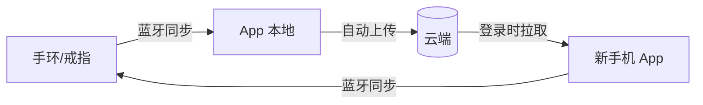

# 睡眠音响 PRD v2 - 数据同步

> 版本：v2 | 日期：2026-06-03 | 阶段：D 模块细化 | 模块：数据同步

---

## 数据同步 · 功能描述

### 核心原则

> **用户不需要知道"同步"这件事。打开 App，数据就在那里。**

### 触发机制（3 条路径）

| 路径 | 触发条件 | 行为 | 用户感知 |
| --- | --- | --- | --- |
| **前台自动同步** | App 进入前台 / 首页可见 + 蓝牙已开启 | 自动扫描已配对设备 → 连接 → 增量拉取 → 静默落库 | 无感，首页数据自动刷新 |
| **下拉同步** | 用户在首页顶部下拉 | 触发扫描 → 连接 → 增量拉取 | 顶部显示旋转指示器 + "正在同步…" |
| **定时通知提醒** | 每天早上 8:00（本地通知） | 推送通知"睡眠数据待同步"，点击 App 触发自动同步 | 通知栏提醒，可关闭 |

*   自动同步为主路径，通常 2~5 秒完成，用户几乎无感
*   下拉同步作为补充，满足用户主动刷新需求，手势触发后首页顶部显示"正在同步…"指示器
*   定时通知仅在设备超过 24 小时未同步时推送，避免打扰

### 同步流程（4 步）

1.  **静默连接**：App 进前台 → 检查蓝牙状态 → 扫描已配对设备 → 自动连接
2.  **增量拉取**：比对时间戳，只拉新数据
3.  **静默落库**：校验 → 写入 → 首页数据自动刷新
4.  **完成**：无 Toast，首页顶部更新为 `上次更新：今天 08:32`

### 关键规则

| 规则 | 说明 |
| --- | --- |
| 增量同步 | 设备端缓存 7 天，只拉新数据 |
| 冲突处理 | 同一晚多次覆盖，以设备时间戳为准 |
| 断点续传 | 中断重连后从已传输的最后一条继续 |
| 蓝牙未开启 | 不可关闭的常驻提示条，不影响其他页面操作 |

---

## 交互流程

```
sequenceDiagram
    actor U as 用户
    participant A as App
    participant D as 手环/戒指

    U->>A: 打开 App
    A->>A: 检查蓝牙状态

    alt 蓝牙未开启
        A->>U: 首页顶部常驻黄色提示条<br/>"蓝牙未开启，无法同步数据" + 可点击跳转系统设置
    else 蓝牙已开启
        A->>D: 静默扫描并连接
        alt 设备未找到
            A->>A: 不提示，展示本地已有数据
        end
        A->>D: 握手，比对时间戳
        D->>A: 返回增量数据
        A->>A: 静默落库 + 首页刷新
        alt 传输异常
            A->>U: 首页顶部橙色提示"上次更新失败，将自动重试"
        end
    end
```

---

## 页面状态

| 状态 | 触发条件 | 界面表现 | 用户操作 |
| --- | --- | --- | --- |
| **未配对** | 新用户未绑定设备 | 空态插图 +「去配对」按钮 | 点击进入配对流程 |
| **蓝牙未开启** | 系统蓝牙关闭 | 首页顶部**常驻**黄色提示条：「蓝牙未开启，无法同步数据」+「去开启」链接 | 点击跳转系统蓝牙设置；提示条不可关闭、不可滑动消除 |
| **正常-同步中** | 正在后台拉取 | 首页顶部微小转圈 + "更新中…"，不影响其他操作 | 无需操作 |
| **正常-已是最新** | 连接成功且无新数据 | 首页展示已有数据 + 顶部 `上次更新：今天 08:32` | 无需操作 |
| **正常-同步完成** | 新数据落库 | 首页数据自动刷新，顶部更新为最新时间，无弹窗无 Toast | 无需操作 |
| **设备不在身边** | 扫描不到设备 | 不提示，正常展示本地已有数据 + `上次更新：昨天 22:15` | 无需操作 |
| **同步异常** | 连接成功但传输失败 | 首页顶部橙色提示「上次更新失败，将自动重试」 | 无需操作，系统自动重试 |
| **超过 7 天未连接** | 设备缓存溢出 | 首次连接成功后弹窗：'手环仅保存最近 7 天数据，xx 月 xx 日之前的数据已丢失' +「知道了」 | 点击确认 |
| **设备电量低** | 同步时检测到电量 \<10% | 首页顶部小字提醒「手环电量不足」 | 提醒充电 |

---

## 蓝牙未开启 · 常驻提示条设计要点

*   **位置**：首页顶部，导航栏下方，始终可见
*   **样式**：黄色/橙色背景，左侧蓝牙图标 + 文字
*   **文案**：`蓝牙未开启，无法同步数据` + 右侧 `去开启` 链接
*   **行为**：点击「去开启」跳转系统蓝牙设置页
*   **关闭规则**：**不可手动关闭**，仅系统蓝牙开启后自动消失
*   **页面覆盖**：首页、睡眠详情、趋势分析等所有需要数据的页面均显示；个人中心、设备管理等非数据页面可不显示
*   **不影响操作**：提示条下方内容正常浏览和交互

---

## 云端同步

> **蓝牙同步完成后，自动上传云端。换手机登录后，自动拉回全部历史数据。全程无感。**

### 数据流全景



### 触发机制

| 阶段 | 触发条件 | 行为 |
|------|----------|------|
| **上传** | 每次蓝牙同步成功后 | 增量上传新增记录至云端，后台静默执行 |
| **下载** | 账号登录成功 / App 进入前台 | 比对云端与本地数据，拉取本地缺失的记录 |
| **重试** | 上传/下载因网络失败 | 自动重试，最多 3 次，均失败则本地标记待上传 |

### 冲突处理

| 场景 | 规则 |
|------|------|
| 同一条记录云端和本地都有 | 以时间戳为准，最新的保留 |
| 换手机后首次登录 | 先拉取全部云端数据，再连接设备同步增量 |
| 多设备同时上传同一晚数据 | 以设备时间戳为准，后到的覆盖先到 |
| 云端数据比设备还新 | 云端为准，设备端该条记录跳过 |

### 页面状态（追加到首页）

| 状态 | 触发条件 | 界面表现 |
|------|----------|----------|
| **云端备份失败** | 上传 3 次均失败 | 首页顶部橙色提示"数据未备份到云端，连接网络后自动重试" |
| **拉取历史数据中** | 新设备登录后首次启动 | 首页顶部转圈"正在恢复历史数据…"，逐条落库 |
| **拉取完成** | 全部历史数据恢复 | 无提示，首页正常展示 |

### 数据安全与隐私

| 维度 | 策略 |
|------|------|
| **上传内容** | 仅上传睡眠指标数值，不上传原始秒级波形数据 |
| **传输加密** | HTTPS |
| **账号绑定** | 数据与账号强绑定，退出登录时保留本地数据，云端保留 |
| **注销** | 注销账号时云端数据同步删除，本地数据退出后保留但不再关联，不可恢复 |
| **未登录场景** | 未登录时仅支持蓝牙本地同步，云端同步功能不可用。登录后自动同步云端数据 |

---

*下一模块：首页仪表盘。*