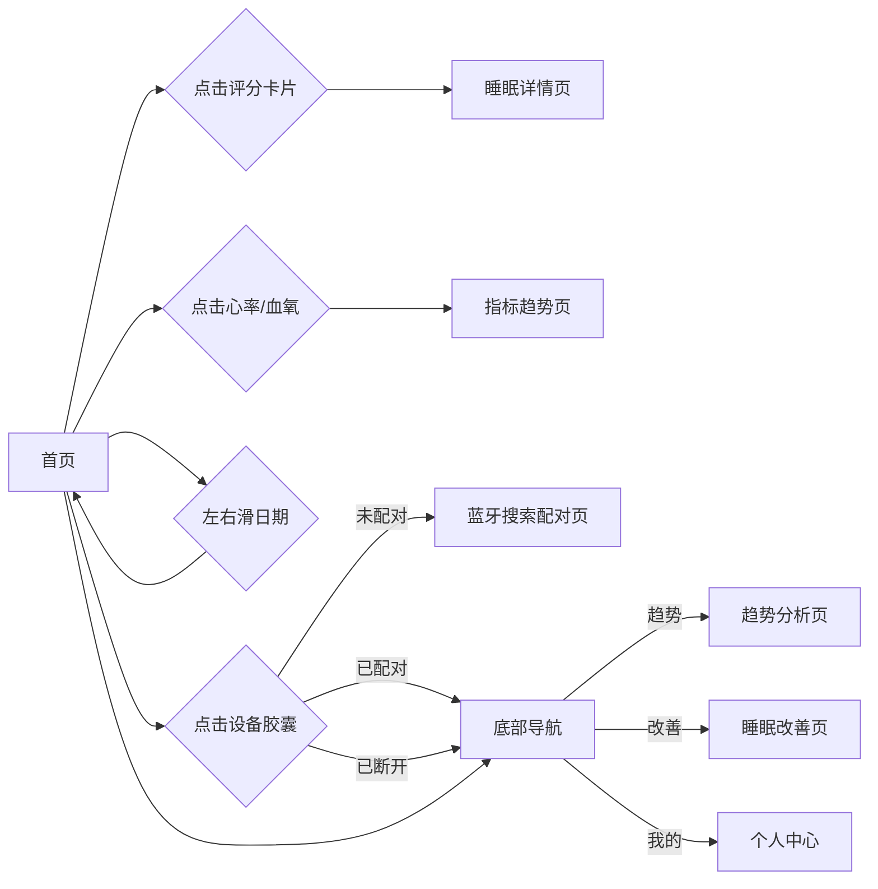

# 睡眠音响 PRD v3 - 首页仪表盘

> 版本：v3 | 日期：2026-06-03 | 阶段：D 模块细化 | 模块：首页仪表盘

---

## 首页仪表盘 · 功能描述

### 页面定位

用户打开 App 的第一屏，一站式概览昨晚睡眠全貌。信息密度适中，核心数据一眼看完。

### 页面布局（从上到下）

```
┌──────────────────────────────┐
│ 💡 每日贴士                   │  ← 睡眠健康建议，可轮换
│ 睡前30分钟减少屏幕使用...      │
├──────────────────────────────┤
│                              │
│   ┌──── 睡眠评分 ──────┐     │
│   │    ╭── 渐变环 ──╮  │     │  ← 渐变底色(cyan→深色)+中心遮罩+覆盖弧
│   │   │     85      │  │     │     + 白光放射状发光
│   │   │    良好     │  │     │
│   │   ╰────────────╯  │     │
│   │ ┌────────────────┐│     │  ← 设备胶囊：圆形图标+名称"智能手环"+电量进度条
│   │ │ ○ 智能手环 85%  ││     │
│   │ └────────────────┘│     │
│   │──────────────────│     │
│   │ 7h12m 23:15→06:27 92%│    │  ← 总时长 / 入睡·醒来 / 效率
│   └──────────────────┘     │
│                              │
├──────────────────────────────┤
│  心率             血氧        │
│  ❤ 62 bpm      💧 97%       │  ← 双指标卡片，点击进入趋势页
├──────────────────────────────┤
│  睡眠阶段         详情 >      │
│  █ █ █ █ █ █ █ █             │  ← 8时段垂直柱状图(清醒灰/浅睡靛/深睡紫/REM青)
│  23 00 01 02 03 04 05 06      │
│  ●清醒 ●浅睡 ●深睡 ●快速眼动   │
├──────────────────────────────┤
│  🏠首页  📈趋势  💡改善  👤我的│  ← 底部导航，当前页高亮(cyan)
└──────────────────────────────┘
```

### 各区域功能说明

| 区域 | 内容 | 交互 |
|------|------|------|
| **每日贴士** | 灯泡图标 + 睡眠健康建议文字，每日轮换 | 无交互，纯展示 |
| **睡眠评分卡片** | 5层叠加评分环：白光放射状发光 → 渐变圆角底色环(cyan→深色) → 中心遮罩圆 → 深色覆盖弧(控制进度) → 居中评分文字。大数字评分(cyan) + 评级(紫色)。设备胶囊：圆形图标 + 名称"智能手环" + 电量进度条(85%)。底部三栏统计：总时长 / 入睡·醒来 / 效率 | 点击进入睡眠详情页；点击设备胶囊 → 未配对→蓝牙搜索页，已配对→设备管理页 |
| **心率/血氧双指标** | 图标(心率红/血氧青) + 名称 + 大数值 + 单位/范围 | 点击进入对应指标的详情趋势页 |
| **睡眠阶段图** | 8时段垂直柱状图：清醒(#F59E4B, 橙色警示)、浅睡(#818CF8)、深睡(#C4B5FD)、REM(#22D3EE)，底部时间轴(23:00~06:00) + 颜色图例。右上角"详情 >"入口 | 点击进入睡眠详情页 |
| **底部导航** | 首页 / 趋势 / 改善 / 我的，当前页高亮(cyan)，其余灰色 | 切换页面 |

---

## 交互流程



---

## 页面状态

| 状态 | 触发条件 | 界面表现 |
|------|----------|----------|
| **空态-无设备** | 新用户未配对 | 每日贴士常驻；评分卡片区域显示空态："绑定手环，开启睡眠追踪" + "连接智能手环后，自动同步睡眠数据" + 青色「去配对」按钮；心率血氧/睡眠阶段不显示 |
| **空态-无数据** | 已配对但设备无数据 | 每日贴士常驻；评分卡片：渐变环黯淡(0%覆盖)、评分显示"--" + "等待数据"、设备胶囊正常(已连接+85%电量)、蓝色提醒条"💡 佩戴手环入睡，明早自动同步数据"、三栏统计均显示"--"；心率/血氧显示"-- bpm" / "--%"占位；睡眠阶段显示"暂无阶段数据" + 灰色占位柱 |
| **正常-有数据** | 已配对且有数据 | 完整展示所有区域，数据为实际值 |
| **数据过期** | 超过 7 天未同步（本地数据显示但已陈旧） | 评分卡片正常展示旧数据，顶部显示"上次更新：7天前"，底部可能出现提示"数据可能不完整" |
| **蓝牙未开启** | 系统蓝牙关闭 | 顶部常驻黄色提示条，其余区域正常展示本地已有数据 |
| **心率/血氧异常** | 心率 <50 或 >100 / 血氧 <90% | 对应指标数字标红，加⚠图标 |
| **部分数据缺失** | 手环只采集了部分指标 | 缺失指标显示"-- 暂无数据"，其余指标正常 |

---

## 评分等级映射

| 分数区间 | 评级 | 原型级颜色 |
|----------|------|------|
| 90-100 | 优秀 | #22D3EE (cyan) |
| 70-89 | 良好 | #C4B5FD (purple) |
| 50-69 | 一般 | #F59E4B (orange) |
| 0-49 | 较差 | #EF4444 (red) |

> 注：当前原型仅实现"良好"(85分)评级，其他等级待后续页面扩展。

---

## 原型实现说明

- 原型文件：`pencil-new.pen`，三个页面：`zavvZ`(正常)、`P7hHK`(空态·无设备)、`vPyRM`(空态·无数据)
- 评分环技术：5层叠加（glow→gradRect→hole→cover→center），无法使用渐变描边，用 rectangle+cornerRadius 模拟渐变底色环
- 设备胶囊：w=182，圆角30px，内部圆形图标+名称+进度条
- 💡 emoji：Pencil 不支持 SVG 嵌入 icon_font，暂用 emoji 替代图标（已知限制）
- 左右滑日期：规划中，原型未实现
- 数据过期/蓝牙未开启/异常指标/部分缺失：规划中，原型未实现
- 底部导航：4项(首页/趋势/改善/我的)，每项40×32 bg框+20×20 path图标+11px标签。活跃：#22D3EE20 bg + #22D3EE图标文字；非活跃：透明bg + #94A3B8。shadow blur:24 color:#00000040
- 状态栏：时间"9:41" + 电池图标(24×12)，所有页面统一
- 清醒/醒来色：#F59E4B（橙色警示），非灰色

---

*下一模块：睡眠详情。*
