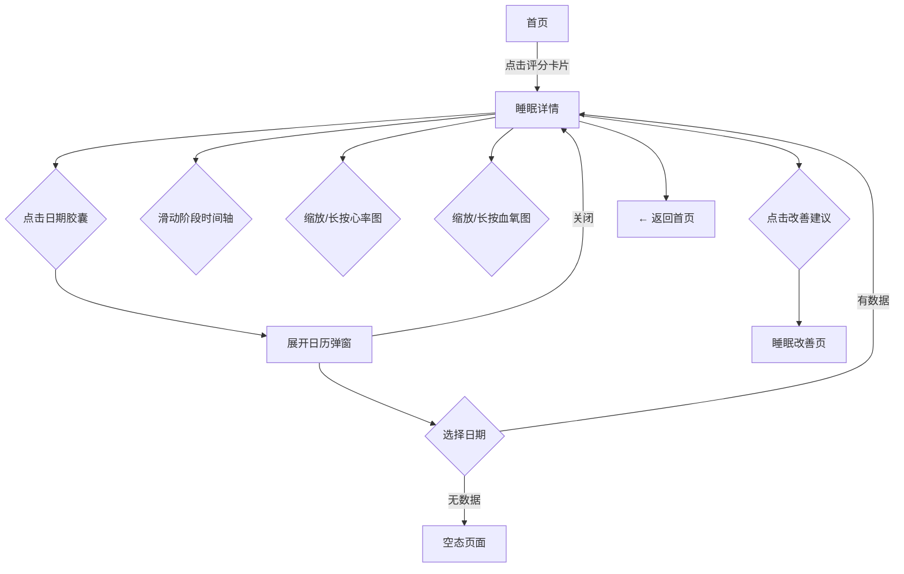

# 睡眠音响 PRD v4 - 睡眠详情

> 版本：v4 | 日期：2026-06-03 | 阶段：D 模块细化 | 模块：睡眠详情

---

## 睡眠详情 · 功能描述

### 页面定位

从首页评分卡片进入，展示**单晚完整睡眠报告**。用户在此深入了解昨晚每个睡眠阶段、心率和血氧的变化细节。

### 页面布局（从上到下，可滚动）

```
┌─────────────────────────────┐
│ ← 返回   [ 6月2日 周三 ▼ ]   │  ← 顶部导航，日期胶囊可点击展开日历弹窗
├─────────────────────────────┤
│                             │
│   ┌─── 睡眠评分 ───────┐    │
│   │       85           │    │
│   │     良好           │    │
│   │                    │    │
│   │  7h 12m  ·  23:15入睡 │  │  ← 紧凑版评分卡片
│   │          06:27醒来     │  │
│   └────────────────────┘    │
│                             │
├─────────────────────────────┤
│  睡眠阶段时间轴              │
│                             │
│  清醒  ▓░░░░░▓░░░░░░░░░░▓▓ │
│  REM   ░░░░░░▓▓░░░░▓▓░░▓▓░ │
│  浅睡  ░▓▓░░░░░▓▓▓░░▓▓▓▓░░ │  ← 4层分段条，段间不重叠（同一时刻只有一种状态）
│  深睡  ░░░▓▓▓░░░░▓▓░░░░░░░ │
│                             │
│  23:00  00:00  01:00  ... 06:30  │
│  ├─ 入睡 ─┤         ├─ 醒来 ─┤   │
│                             │
│  [ 清醒 5m ]  [ 3次醒来 ] [ 入睡耗时 12m ]  │  ← 关键指标横条，清醒/醒来颜色一致
├─────────────────────────────┤
│  心率趋势                    │
│                             │
│  bpm                        │
│  80 ┤        ╭─╮            │
│  70 ┤   ╭╮  ╭╯ ╰╮  ╭╮     │  ← 折线图
│  60 ┤ ╭╮╰╰╮╭╯   ╰╮╭╯╰╮    │
│  50 ┤─╯    ╰╯      ╰╯   ╰── │
│     └──────────────────    │
│     23:00          06:30   │
│                             │
│  夜间均值 62 bpm  范围 52-78 │
├─────────────────────────────┤
│  血氧趋势                    │
│                             │
│  %                          │
│  100┤  ╭────────╮  ╭───    │  ← 折线图
│   98┤──╯        ╰──╯       │
│   96┤                      │
│   94┤            ⚠ 最低 93% │  ← 异常标注
│     └──────────────────    │
│     23:00          06:30   │
│                             │
│  夜间均值 97%  最低 93%     │
├─────────────────────────────┤
│  改善建议                    │
│  ┌─────────────────────┐    │
│  │ 💡 入睡耗时偏长(12m) │    │
│  │ 建议睡前30分钟远离手机│    │  ← 关联到改善模块
│  └─────────────────────┘    │
└─────────────────────────────┘
```

### 各区域功能说明

| 区域 | 内容 | 交互 |
|------|------|------|
| **顶部导航** | 返回按钮 + 可点击日期胶囊(6月2日 周三 ▼)，展开态为实心cyan+▲箭头+深色字，默认态为半透明底+▼箭头+浅色字 | 返回首页；点击胶囊展开日历弹窗选择日期 |
| **日期弹窗** | 顶部 `< 2026年6月 >` 可切换月份（左箭头灰色=边界，右箭头cyan=可点）。月历网格，7列×5行，每日期36px圆形按钮。选中日期：cyan实心圆+深色字(#22D3EE/#0F172A)。有数据日期：白色字+底部cyan圆点(#22D3EE)。无数据日期：灰色字(#64748B)+底部灰色圆点(#334155)。面板底色#0F172A+cyan边框，与卡片背景区分 | 点击日期切换查看；点击左右箭头切换月份；点击面板外关闭 |
| **评分卡片** | 精简版评分 + 入睡/醒来时间 | 纯展示 |
| **睡眠阶段时间轴** | 4层横向分段条（清醒#F59E4B/REM#22D3EE/浅睡#818CF8/深睡#C4B5FD），各段非重叠、表示单一时刻的唯一状态。清醒用橙色：醒来属异常事件，需引起注意 | 左右滑动浏览完整时间线 |
| **关键指标横条** | 清醒总时长(#F59E4B) / 醒来次数(#F59E4B) / 入睡耗时(#F1F5F9)，清醒和醒来使用同一警示色 | 纯展示 |
| **心率趋势图** | 整晚心率折线图，标注均值和范围 | 可横向缩放；长按查看具体时间点数值 |
| **血氧趋势图** | 整晚血氧折线图，异常点标红 + ⚠ | 可横向缩放；长按查看具体时间点数值 |
| **改善建议卡片** | 基于该晚数据生成的 1~2 条建议 | 点击跳转到改善计划页 |

---

## 交互流程



---

## 页面状态

| 状态 | 触发条件 | 界面表现 |
|------|----------|----------|
| **正常-完整数据** | 该晚所有数据齐全 | 全部区域正常展示 |
| **日历展开** | 点击日期胶囊 | 半屏日历弹窗浮于内容上方（面板底色#0F172A+cyan边框），日期按钮+数据圆点，可切换日期 |
| **部分数据缺失** | 心率或血氧单类缺失 | 缺失图表区显示"-- 暂无数据"，其余正常 |
| **数据为空** | 该日期无任何睡眠记录 | 全页空态："该日期暂无睡眠数据" + 前一天/后一天快捷按钮 |
| **异常标注** | 心率<50或>100 / 血氧<93% | 对应图表异常区间标红 + ⚠图标 + 数值标红 |
| **多次醒来** | 清醒段 ≥3 次 | 指标横条中"醒来次数"标橙色(#F59E4B)，附提示"夜间醒来偏多" |
| **加载中** | 数据量大，图表渲染中 | 页面骨架屏占位，逐块加载完成 |

---

## 原型实现说明

- 原型文件：`pencil-new.pen`，三态：`HVBAP`(默认)、`wdoG2`(日历展开)、`pTRqQ`(空态)
- 日期胶囊：默认态 `fill:#22D3EE10, stroke:#22D3EE30`，文字 `#F1F5F9`，箭头 ▼；展开态 `fill:#22D3EE, stroke:#22D3EE`，文字 `#0F172A`，箭头 ▲
- 日历面板：`layoutPosition:"absolute"` 浮于内容上方，底色 `#0F172A` 与卡片 `#1E293B` 区分
- 日历圆点：有数据 `#22D3EE` 4px，无数据 `#334155` 4px
- 清醒/醒来色：`#F59E4B`（橙色警示），非灰色
- 睡眠阶段轴：4行分段条非重叠，同一时刻只有一种状态

---

*下一模块：趋势分析。*
