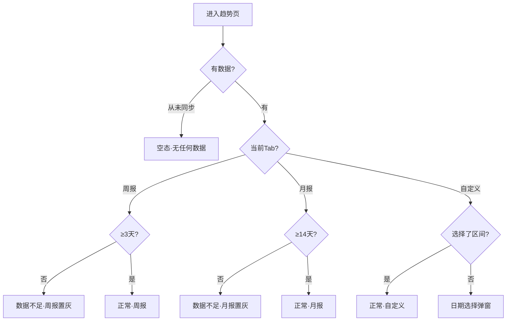

# 睡眠音响 PRD v5 - 趋势分析

> 版本：v5 | 日期：2026-06-03 | 阶段：D 模块细化 | 模块：趋势分析

---

## 趋势分析 · 功能描述

### 页面定位

从底部导航「趋势」进入，用户查看睡眠数据的**中长期变化趋势**。这是失眠/睡眠障碍人群的核心使用场景——通过趋势发现规律、验证改善效果。

### 页面布局（从上到下，可滚动）

```
┌─────────────────────────────┐
│  睡眠趋势                    │
├─────────────────────────────┤
│  [周报]  [月报]  [自定义]    │  ← 视图切换 Tab
├─────────────────────────────┤
│  < 6月1日 - 6月7日 >         │  ← 区间切换（左右箭头），底部仅一处"较上周+2"
│                             │
│  ┌── 睡眠评分趋势 ──────┐   │
│  │ 分                    │   │
│  │ 90┤     █             │   │
│  │ 85┤ █   █   █   █    │   │  ← 柱状图，每柱=1晚
│  │ 80┤ █ █ █ █ █   █    │   │
│  │ 75┤ █ █ █ █ █ █ █    │   │
│  │    └─┬─┬─┬─┬─┬─┬─   │   │
│  │     1 2 3 4 5 6 7日   │   │
│  │                       │   │
│  │  本周均值 83  ↑ 较上周 +2│   │
│  └───────────────────────┘   │
│                             │
│  睡眠时长趋势                │
│  ┌──────────────────────┐   │
│  │ 小时                  │   │
│  │ 8┤     █             │   │
│  │ 7┤ █ █ █   █   █ █  │   │  ← 柱状图
│  │ 6┤ █ █ █ █ █ █ █ █  │   │
│  │   └─┬─┬─┬─┬─┬─┬─   │   │
│  │    一 二 三 四 五 六 日  │   │
│  │                       │   │
│  │  本周均值 7.2h  目标 7.5h│   │
│  └───────────────────────┘   │
│                             │
│  入睡时间稳定性              │
│  ┌──────────────────────┐   │
│  │ 23:00 ●               │   │
│  │ 23:30    ●  ●         │   │  ← 散点图，每点=1晚
│  │ 00:00        ●  ●  ● │   │
│  │ 00:30               ● │   │
│  │ 01:00                 ●│   │
│  │    ─┬─┬─┬─┬─┬─┬─    │   │
│  │    一 二 三 四 五 六 日 │   │
│  │                       │   │
│  │  偏差 ±42分钟  ⚠ 作息不规律│   │
│  └───────────────────────┘   │
│                             │
│  深睡占比趋势                │
│  ┌──────────────────────┐   │
│  │  %                    │   │
│  │ 30┤ ╭──╮  ╭──╮       │   │
│  │ 20┤╯  ╰──╯  ╰──╮    │   │  ← 折线图
│  │ 10┤              ╰── │   │
│  │    └─┬─┬─┬─┬─┬─┬─   │   │
│  │     1 2 3 4 5 6 7日   │   │
│  │                       │   │
│  │  本周均值 22%  正常范围 20-25%│
│  └───────────────────────┘   │
│                             │
│  [查看完整月度报告 →]        │  ← 切到月报的快捷入口
├─────────────────────────────┤
│  🏠首页  �趋势  💡改善  👤我的 │  ← 底部导航，含20×20图标，活跃项#22D3EE bg框
└─────────────────────────────┘
```

### 三种视图

| 视图 | 数据粒度 | 默认区间 | 用途 |
|------|----------|----------|------|
| **周报** | 按天 | 最近 7 天 | 日常查看，短期调整 |
| **月报** | 按周（4-5 周汇总） | 最近 30 天 | 月度复盘，发现大趋势 |
| **自定义** | 按天 | 用户自选起止日 | 灵活对比任意时段 |

### 趋势指标

| 指标 | 图表类型 | 说明 | 异常规则 |
|------|----------|------|----------|
| **睡眠评分** | 柱状图 | 每晚评分，均值线 + 对比上一周期 | 连续 3 天 < 60 标红提示 |
| **睡眠时长** | 柱状图 | 每晚总时长，可叠加显示用户设定的目标线 | 偏离目标 ±2h 标注 |
| **入睡时间** | 散点图 | 每晚上床时间分布，判断作息规律性 | 偏差 > ±1h 提示"作息不规律" |
| **深睡占比** | 折线图 | 深睡时长占总时长百分比趋势 | < 15% 持续 3 天提示 |
| **心率均值** | 折线图 | 夜间平均心率趋势 | 🚧 原型未实现 |
| **血氧最低值** | 折线图 | 夜间血氧最低值趋势 | 🚧 原型未实现 |

### 原型页面清单（7页）

| 页面 | 位置 | 说明 |
|------|------|------|
| 趋势分析·周报 | ejfHW | 4 图（评分/时长/稳定性/深睡），7 日数据 |
| 趋势分析·月报 | Ccd0B | 4 图，30 日节点曲线，W1-W4 X轴 |
| 趋势分析·月报·点击详情 | QryTs/PJ0Hs | 复制月报结构 + tooltip 浮层，点击数据点显示当日值 |
| 趋势分析·空态 | FQv0A | 无数据提示 |
| 趋势分析·加载中 | KE2Kg | 骨架屏 |
| 趋势分析·自定义 | XiHGi | 4 图 + 日期范围选择器 |
| 趋势分析·自定义·日期选择 | QryTs | 复制自定义结构 + 半透明遮罩 + 日期浮层弹窗 |

---

## 图表显示逻辑

### 睡眠评分趋势（折线图）
- **Y轴**：动态范围 `dataMin-10 ~ dataMax+10`
- **参考线**：本周均值 + 上周对比线（色带+标签胶囊）
- **X轴**：7天日期（1日-7日）
- **颜色**：折线 `#C4B5FD` 2.5px + 6px 数据圆点
- **异常**：连续3天<60 圆点变 `#EF4444`

### 睡眠时长趋势（折线图）
- **Y轴**：动态范围 `dataMin-0.5h ~ dataMax+0.5h`
- **参考线**：本周均值线（色带+标签胶囊）
- **X轴**：7天星期（一-日）
- **颜色**：折线 `#818CF8` 2.5px + 6px 数据圆点

### 入睡时间散点图
- **Y轴**：固定时间刻度 23:00-01:00
- **异常**：偏差 > ±1h 标橙色 `#F59E4B`
- **X轴**：7天星期（一-日）

### 深睡占比折线图
- **Y轴**：固定 10%-30%
- **参考线**：本周均值线
- **X轴**：7天日期（1日-7日）
- **颜色**：折线 `#C4B5FD` 2px

---

## 交互流程

```mermaid
flowchart TD
    A[趋势页] --> B{切换视图}
    B -->|周报| C[周视图：按天柱状图]
    B -->|月报| D[月视图：按周汇总]
    B -->|自定义| E[弹窗选起止日期]
    E --> F[自定义区间视图]
    
    C --> G{长按某一天柱子}
    G --> H[浮层：该晚具体数值]
    
    C --> I{点击某指标区域}
    I --> J[跳转该指标详情/该晚睡眠详情]
    
    C --> K{点击"完整月度报告"}
    K --> D
    
    C --> L[底部导航]
    L -->|首页| M[首页]
    L -->|改善| N[睡眠改善页]
    L -->|我的| O[个人中心]
```

---

## 页面状态判定



### 页面状态

| 状态 | 触发条件 | 界面表现 | 原型 ID |
|------|----------|----------|----------|
| **正常-周报** | 有 ≥3 天数据，选周报 Tab | 4 张趋势图 + 对比上周变化 | `ejfHW` |
| **正常-月报** | 有 ≥14 天数据，选月报 Tab | 4 张趋势图按周汇总 + 对比上月 | `Ccd0B` |
| **正常-自定义** | 选择自定义区间 | 所选区间按天展示 | `XiHGi` |
| **自定义-数据量少** | 自定义区间 <3 天 | 所选区间按天展示 + 底部提示"数据量较少，趋势仅供参考" | `XiHGi` |
| **空态-无数据** | 从未同步过 | 空态插图 + "同步数据后展示趋势" | `FQv0A` |
| **加载中** | 图表渲染中 | 骨架屏占位，逐块加载 | `KE2Kg` |
| **月报·点击详情** | 点击月报柱子 | 弹窗展示该周明细 | `PJ0Hs` |
| **自定义·日期选择** | 点击自定义 Tab | 日期选择器弹窗 | `QryTs` |
| **数据不足** | 天数不满足 Tab 要求 | Tab 置灰不可选 + 提示最少天数 | 复用空态 |

> **对比数据**（非独立状态）：有上一周期数据时，每条指标下方显示"较上周 +2"或"较上月 -1"

### 页面跳转与交互

| 点击区域 | 目标 | 携带参数 |
|----------|------|----------|
| Tab·周报 | 趋势·周报 | 默认最近 7 天 |
| Tab·月报 | 趋势·月报 | 默认最近 30 天 |
| Tab·自定义 | 自定义·日期选择弹窗 | — |
| ← → 箭头 | 切换上一/下一周期 | 偏移量 |
| 月报柱子 | 月报·点击详情 | 该周数据 |
| 图表数据点 | 无交互（仅展示 tooltip） | — |
| 底栏·首页 | 首页 | — |
| 底栏·趋势 | 当前页（高亮） | — |
| 底栏·改善 | 改善建议 | — |
| 底栏·我的 | 个人中心 | — |

### 原型实现说明

- 原型文件：`pencil-new.pen`，7 页，均为 `layout:"vertical"`，padding:[46,16,16,16]，gap:16
- 图表卡统一：cornerRadius:16，fill:#1E293B，gap:12，padding:20，stroke:#334155
- Tab 栏：cornerRadius:20，gap:4，padding:4
- 底栏：趋势 Tab 高亮 cyan
- 状态栏统一规格 + 底栏 SVG 路径图标

---
