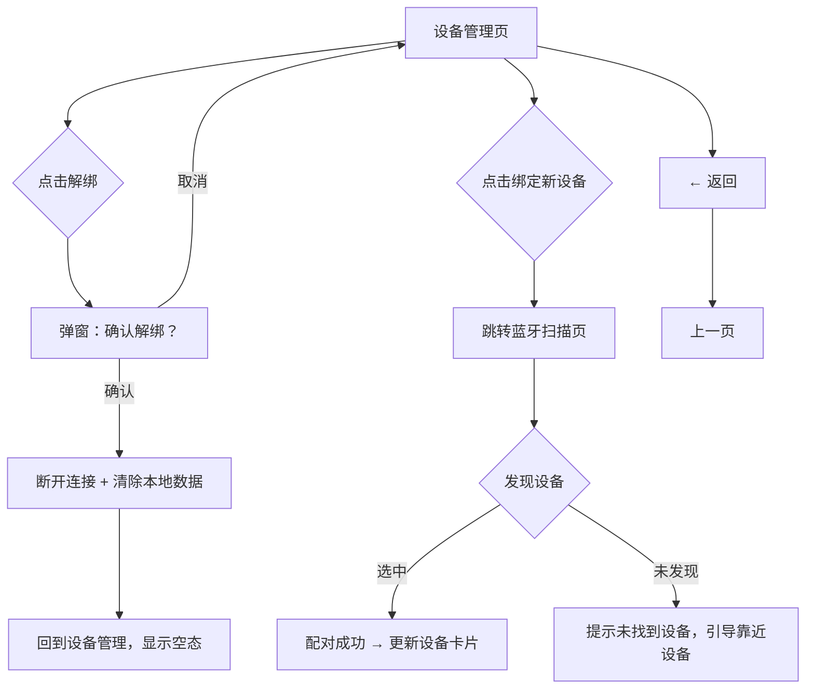

# 睡眠音响 PRD v7 - 设备管理

> 版本：v7 | 日期：2026-06-03 | 阶段：D 模块细化 | 模块：设备管理

---

## 设备管理 · 功能描述

### 页面定位

从首页或引导页进入，管理手环/戒指的绑定、解绑。轻量页面，操作频率极低。

### 页面布局

```
┌─────────────────────────────┐
│ ← 返回    设备管理           │
├─────────────────────────────┤
│                             │
│  已绑定设备                  │
│                             │
│  ┌─────────────────────┐    │
│  │ ⌚ 睡眠手环 Pro       │    │  ← 设备卡片
│  │                     │    │
│  │ 型号：SBP-2025       │    │
│  │ 电量：🟢 85%        │    │
│  │ 固件：v2.1.3        │    │
│  │ 最后同步：今天 08:32 │    │
│  │                     │    │
│  │ [解绑设备]           │    │
│  └─────────────────────┘    │
│                             │
│  ───────────────────────    │
│                             │
│  [+ 绑定新设备]             │  ← 进入配对流程
│                             │
│  ───────────────────────    │
│                             │
│  同步记录                    │
│  ┌─────────────────────┐    │
│  │ 今天 08:32  同步成功 │    │  ← 最近 5 条同步日志
│  │ 昨天 08:15  同步成功 │    │
│  │ 6/1 09:01  同步成功 │    │
│  │ 5/30  --  同步失败   │    │
│  │ 5/29 08:22  同步成功 │    │
│  └─────────────────────┘    │
│                             │
└─────────────────────────────┘
```

### 功能说明

| 功能 | 说明 | 交互 |
|------|------|------|
| **设备信息卡片** | 名称、型号、电量（🟢>20% / 🟡10-20% / 🔴<10%）、固件版本、最后同步时间 | 纯展示 |
| **解绑设备** | 移除设备绑定，清空本地该设备的所有数据 | 二次确认弹窗："解绑后将清除该设备的本地数据，云端数据保留" |
| **绑定新设备** | 发起蓝牙扫描，搜索附近可配对手环/戒指 | 进入配对引导流程 |
| **同步记录** | 最近 5 条日志，含时间戳和结果 | 纯展示 |

---

## 交互流程



---

## 页面状态

| 状态 | 触发条件 | 界面表现 |
|------|----------|----------|
| **有设备** | 已有绑定设备 | 显示设备卡片 + 同步记录 |
| **空态-无设备** | 未绑定或已解绑 | 空态插图 + "尚未绑定设备" +「绑定新设备」按钮 |
| **解绑确认** | 点击解绑时 | 底部弹窗，确认/取消 |
| **配对搜不到** | 扫描超时无结果 | 提示："未发现设备，请确保手环已开机且靠近手机" +「重新搜索」 |
| **设备电量低** | 电量 <10% | 设备卡片电量标红 + "建议充电"提示 |

---

*下一模块：个人中心。*

> **原型实现说明**：状态栏(time 9:41+电池) 统一规格，参考首页仪表盘。设备管理页无底部导航（有返回按钮的子页面）。
