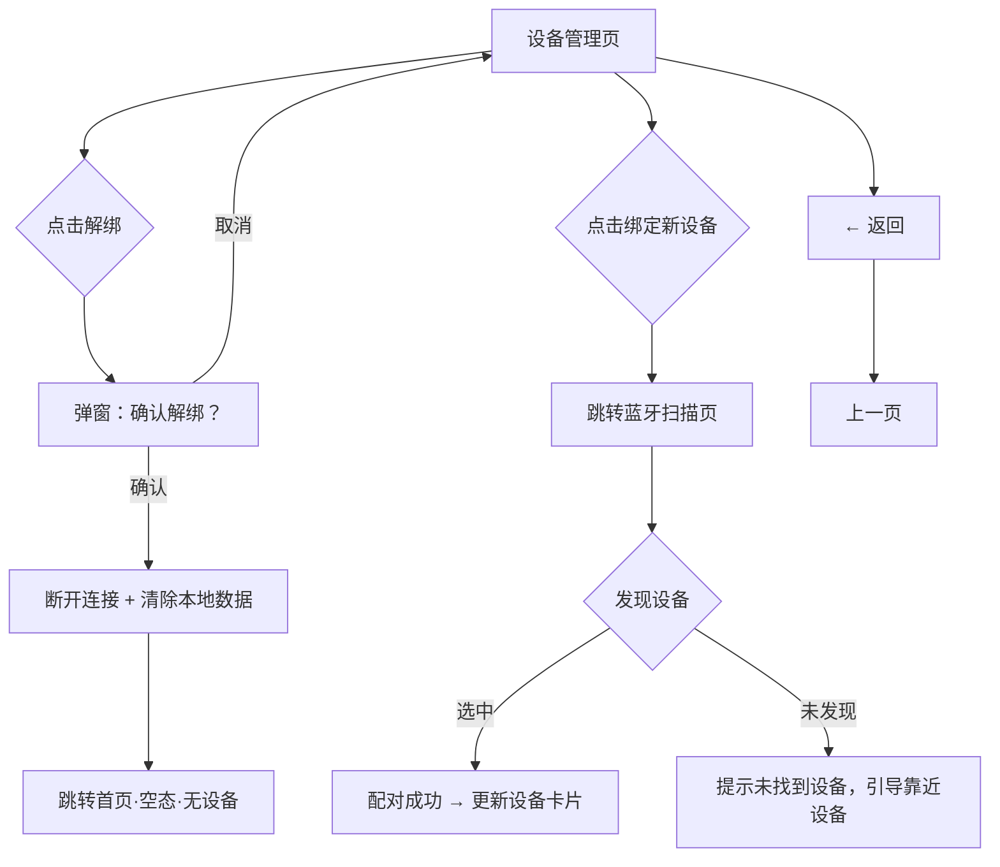

# 睡眠音响 PRD v7 - 设备管理

> 版本：v7 | 日期：2026-06-03 | 阶段：D 模块细化 | 模块：设备管理

---

## 设备管理 · 功能描述

### 页面定位

从首页或引导页进入，管理手环/戒指的绑定、解绑。轻量页面，操作频率极低。

### 页面布局

```
┌─────────────────────────────┐
│ ← 返回    设备管理           │
├─────────────────────────────┤
│                             │
│  已绑定设备                  │
│                             │
│  ┌─────────────────────┐    │
│  │ ⌚ 睡眠手环 Pro       │    │  ← 设备卡片
│  │                     │    │
│  │ 型号：SBP-2025       │    │
│  │ 电量：🟢 85%        │    │
│  │ 固件：v2.1.3        │    │
│  │ 最后同步：今天 08:32 │    │
│  │                     │    │
│  │ [解绑设备]           │    │
│  └─────────────────────┘    │
│                             │
│  ───────────────────────    │
│                             │
│  [+ 绑定新设备]             │  ← 进入配对流程
│                             │
│  ───────────────────────    │
│                             │
│  同步记录                    │
│  ┌─────────────────────┐    │
│  │ 今天 08:32  同步成功 │    │  ← 最近 5 条同步日志
│  │ 昨天 08:15  同步成功 │    │
│  │ 6/1 09:01  同步成功 │    │
│  │ 5/30  --  同步失败   │    │
│  │ 5/29 08:22  同步成功 │    │
│  └─────────────────────┘    │
│                             │
└─────────────────────────────┘
```

### 功能说明

| 功能 | 说明 | 交互 |
|------|------|------|
| **设备信息卡片** | 名称、型号、电量（🟢>20% / 🟡10-20% / 🔴<10%）、固件版本、最后同步时间 | 纯展示 |
| **解绑设备** | 移除设备绑定，**本地+云端同时清除该设备的所有数据，不可恢复** | 二次确认弹窗："解绑后将永久删除该设备的所有数据（本地+云端），不可恢复" |
| **绑定新设备** | 发起蓝牙扫描，搜索附近可配对手环/戒指 | 进入配对引导流程 |
| **同步记录** | 最近 5 条日志，含时间戳和结果 | 纯展示 |

---

## 配对流程详细定义

### 配对扫描页

**触发**：点击"绑定新设备"按钮

**页面元素**：

| 区域 | 内容 | 说明 |
|------|------|------|
| 顶部导航 | ← 返回 + 标题"绑定新设备" | 返回到设备管理页 |
| 状态文本 | "正在搜索附近设备..." | 持续展示直到超时 |
| 扫描动画区 | 信号波纹动画 + 设备图标 | 居中展示，暗示正在搜索 |
| 引导文本 | "请将设备靠近手机" + "确保设备已开机且蓝牙已开启" | 帮助用户排查问题 |
| 发现设备列表 | 设备名 + 信号强度 + 连接按钮 | 每发现一台设备动态追加 |

**扫描流程**：

```mermaid
flowchart TD
    A[进入扫描页] --> B[启动蓝牙扫描]
    B --> C{10秒内发现设备?}
    C -->|是| D[设备列表动态追加]
    D --> E{用户点击连接}
    E --> F[配对中...]
    F -->|成功| G[→ 设备管理列表 + 提示"绑定成功"]
    F -->|失败| H[提示"配对失败，请重试"]
    C -->|否| I[超时 → 配对搜不到页]
```

**发现设备列表项**：

```
┌───────────────────────────────────┐
│ ○ 睡眠手环 Pro          信号: 强   │
│   型号: SBP-2025                   │
│                        [连接]     │
└───────────────────────────────────┘
```

- 设备图标：灰色圆形 + 设备类型图标
- 信号强度：强/中/弱（文字+颜色）
  - 强：#22D3EE
  - 中：#F59E4B
  - 弱：#EF4444
- 连接按钮：cyan 圆角按钮

**状态转换**：

| 状态 | 触发条件 | 界面表现 |
|------|----------|----------|
| 搜索中 | 进入扫描页 | 波纹动画 + "正在搜索附近设备..." |
| 发现设备 | 蓝牙扫描到设备 | 列表追加设备项 |
| 配对中 | 点击"连接" | 按钮变为 loading 转圈 |
| 配对成功 | 蓝牙配对完成 | 提示"绑定成功" + 跳转设备管理 |
| 配对失败 | 蓝牙配对失败 | 提示"配对失败，请重试" |
| 搜索超时 | 10秒内未发现任何设备 | 跳转"配对搜不到"页 |

### 配对搜不到页

**触发**：扫描超时无结果

**页面元素**：

| 区域 | 内容 | 说明 |
|------|------|------|
| 顶部导航 | ← 返回 + 标题"绑定新设备" | 返回到设备管理页 |
| 空态插图 | 设备图标 + 信号弱图标 | 居中展示 |
| 提示标题 | "未发现设备" | 16px 加粗 |
| 提示说明 | "请确保手环已开机且靠近手机，蓝牙已开启" | 13px 辅助文字 |
| 重新搜索按钮 | 青色圆角按钮 | 点击回到扫描状态 |

**交互**：

| 操作 | 结果 |
|------|------|
| 点击"重新搜索" | 回到扫描动画状态，重新开始 10 秒扫描 |
| 点击"← 返回" | 返回设备管理页 |

---

## 交互流程



---

## 页面状态

| 状态 | 触发条件 | 界面表现 | 原型 ID |
|------|----------|----------|---------|
| **有设备（单）** | 已绑定 1 台设备 | 设备卡片 + 同步记录 | `oriEY` |
| **多设备列表** | 已绑定 2+ 台设备 | 设备列表（活跃 cyan + 非活跃灰）+ 同步记录 | `wvKca` |
| **解绑确认（单）** | 单设备点击解绑 | 遮罩 + 弹窗 | `t1iZf6` |
| **解绑确认（多）** | 多设备点击解绑 | 遮罩 + 弹窗（删除后显示空设备卡） | `cEgsu` |
| **配对扫描中** | 点击绑定新设备 | 搜索动画 + 发现设备列表 | `isZvr` |
| **配对搜不到** | 扫描超时无结果 | 空态提示 + 重新搜索 | `OlcC3` |
| **设备电量低** | 电量 <10% | 设备卡电量标红 + 警告 | `ADwjy` |

> ⚠️ **无空态**：设备管理页入口仅在已绑定设备时可见（首页正常态/个人中心），不存在无设备场景。解绑后跳转首页空态。

---

### 原型实现说明

- 原型文件：`pencil-new.pen`，7 页，`layout:"vertical"`，无底部导航（子页面）
- 设备卡片：cornerRadius:16, fill:#1E293B, stroke:#334155
- 活跃设备：stroke:#22D3EE, strokeWidth:1.5 + "活跃"标签
- 解绑弹窗：遮罩 #0F172ACC + 弹窗 stroke:#EF4444
- 配对扫描：波纹动画 + 设备列表
- 配对搜不到：居中空态 + 重新搜索按钮
- 电量低：stroke:#EF44420 + 电量数字标红

---

## 多设备支持

### 核心规则

| 规则 | 说明 |
|------|------|
| 绑定数量 | 不限，用户可自由绑定 |
| 数据隔离 | 每台设备独立存储睡眠数据，互不合并 |
| 活跃设备 | 全 App 统一，切换一次全局生效 |
| 同时佩戴 | 支持（如白天手环、夜间戒指），数据按设备独立 |
| 自动识别 | 不做，用户需手动切换 |

### 多设备同步规则

| 规则 | 说明 |
|------|------|
| 同时连接 | 支持多台设备同时蓝牙连接，依次轮询同步 |
| 单台失败 | 一台设备同步失败不影响其他设备 |
| 数据归属 | 每条数据记录携带 deviceId，不混合 |
| 展示逻辑 | 首页/详情/趋势/改善 仅展示活跃设备数据 |
| 冲突处理 | 同一天两个设备都有数据时，各自保留，不覆盖 |

### 设备胶囊交互（多设备时）

| 状态 | 单设备 | 多设备 |
|------|--------|--------|
| 胶囊点击 | 跳转设备管理 | 展开下拉列表 |
| 下拉列表 | 无 | 设备名 + 电量 + 活跃标记 + 添加新设备 |
| 设备切换 | 无 | 全 App 数据联动刷新 |

### 原型

- 设备胶囊下拉：`l22jqB`
- 多设备列表：`wvKca`
- 多设备解绑确认：`cEgsu`

---

## 多设备登录场景

### 核心概念

| 概念 | 定义 | 说明 |
|------|------|------|
| **账号层绑定** | 设备 ↔ 账号的关联关系 | 云端存储，多设备登录同一账号时都可见 |
| **连接层配对** | App ↔ 设备的蓝牙连接 | 本地存储，每台手机独立配对 |
| **断开连接** | 蓝牙通信暂时中断 | 设备仍在账号下，重新靠近后自动恢复 |
| **解绑设备** | 彻底移除设备与账号的关联 | 本地+云端同时清除该设备数据，不可恢复 |

### 场景示例

```
场景1：用户有两台手机
- 手机A 配对了手环 → 手环绑定关系上传云端
- 手机B 登录同账号 → 设备管理页显示"睡眠手环 Pro [未连接]"
- 手机B 点击"连接" → 蓝牙配对 → 可以同步数据

场景2：用户换新手机
- 旧手机：设备绑定关系在云端
- 新手机登录同账号 → 设备管理页显示已绑设备列表
- 选择设备点击"连接" → 蓝牙配对 → 云端数据自动同步

场景3：用户解绑设备
- 解绑后：本地+云端同时清除该设备数据
- 重新绑定同一设备：相当于新设备，从零开始
```

### 设备管理页状态（多设备登录时）

| 状态 | 触发条件 | 界面表现 |
|------|----------|----------|
| **已绑定·已连接** | 账号下有设备且当前手机已蓝牙配对 | 设备卡片显示完整信息，状态标记"已连接" |
| **已绑定·未连接** | 账号下有设备但当前手机未配对 | 设备卡片显示基本信息，状态标记"未连接"，显示"连接"按钮 |
| **未绑定** | 账号下无设备 | 空态，显示"绑定新设备"引导 |

---
