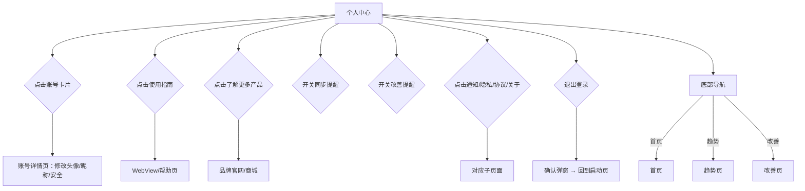

# 睡眠音响 PRD v8 - 个人中心

> 版本：v8 | 日期：2026-06-03 | 阶段：D 模块细化 | 模块：个人中心

---

## 个人中心 · 功能描述

### 页面定位

从底部导航「我的」进入。集账号管理、音响品牌展示、设置于一体。**这是音响品牌露出的核心页**。

### 页面布局（可滚动）

```
┌─────────────────────────────┐
│  我的                        │
├─────────────────────────────┤
│                             │
│  ┌─ 账号 ───────────────┐   │
│  │ 👤 头像  用户昵称     │   │
│  │      ID: 123456789   │   │  ← 账号卡片，点击进入账号管理
│  │                      │   │
│  │  累计追踪 127 晚      │   │
│  │  [编辑资料 →]        │   │
│  └──────────────────────┘   │
│                             │
│  ───────────────────────    │
│                             │
│  ┌─ 我的音响 ───────────┐   │  ← 品牌展示区
│  │                      │   │
│  │  [音响产品图/渲染图]  │   │
│  │                      │   │
│  │  🌙 睡眠音响 Pro     │   │
│  │  白噪音 · 助眠音效   │   │
│  │  · 智能定时         │   │
│  │                      │   │
│  │  [查看使用指南 →]    │   │
│  │  [了解更多产品 →]    │   │
│  │                      │   │
│  └──────────────────────┘   │
│                             │
│  ───────────────────────    │
│                             │
│  设置                       │
│  ┌──────────────────────┐   │
│  │ 同步提醒        [开关] │   │  ← 每日 8:00 提醒
│  │ 改善提醒        [开关] │   │  ← 每日 21:00 提醒
│  │ 通知设置         >    │   │
│  │ 隐私政策         >    │   │
│  │ 用户协议         >    │   │
│  │ 关于             >    │   │
│  └──────────────────────┘   │
│                             │
│  ───────────────────────    │
│                             │
│        退出登录             │
│                             │
├─────────────────────────────┤
│  🏠首页  📊趋势  💡改善  👤我的 │
└─────────────────────────────┘
```

### 各区域功能说明

| 区域 | 内容 | 交互 |
|------|------|------|
| **账号卡片** | 头像、昵称、ID、累计追踪天数 | 点击进入账号详情（修改头像/昵称、账号安全） |
| **音响品牌展示区** | 音响产品图 + 名称 + 卖点简述 + 两个入口 | 产品图占视觉重心，体现品牌调性 |
| **使用指南** | 跳转音响使用说明（图文/视频） | 点击打开 WebView 或本地帮助页 |
| **了解更多产品** | 品牌其他产品展示/购买入口 | 点击跳转品牌官网或商城 |
| **设置列表** | 同步提醒开关、改善提醒开关、通知、隐私、协议、关于 | 开关即时生效，其他跳转子页 |
| **退出登录** | 退出当前账号 | 二次确认弹窗 |

---

## 交互流程



---

## 页面状态

| 状态 | 触发条件 | 界面表现 |
|------|----------|----------|
| **正常-已登录** | 已登录账号 | 完整展示所有区域 |
| **未登录** | 游客模式/未登录 | 账号卡片显示"点击登录"，点击跳转登录页；音响品牌区正常展示；部分设置项不显示 |
| **无追踪数据** | 新用户未曾同步 | 累计追踪显示"0 晚" |
| **网络异常** | 品牌区图片/链接加载失败 | 品牌区显示占位图 + "加载失败，点击重试" |

---

*阶段 D 全部模块细化完毕。*

> **原型实现说明**：状态栏(time 9:41+电池) + 底部导航统一规格，参考首页仪表盘。
