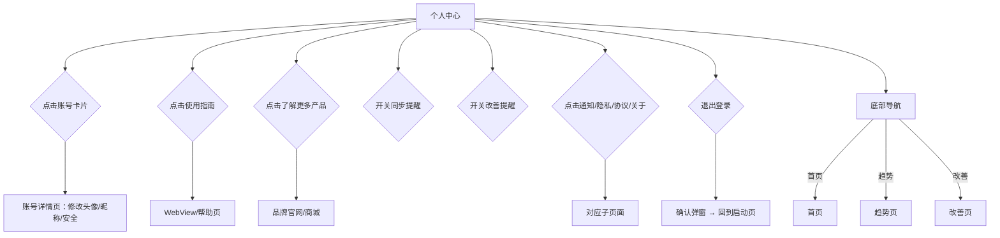
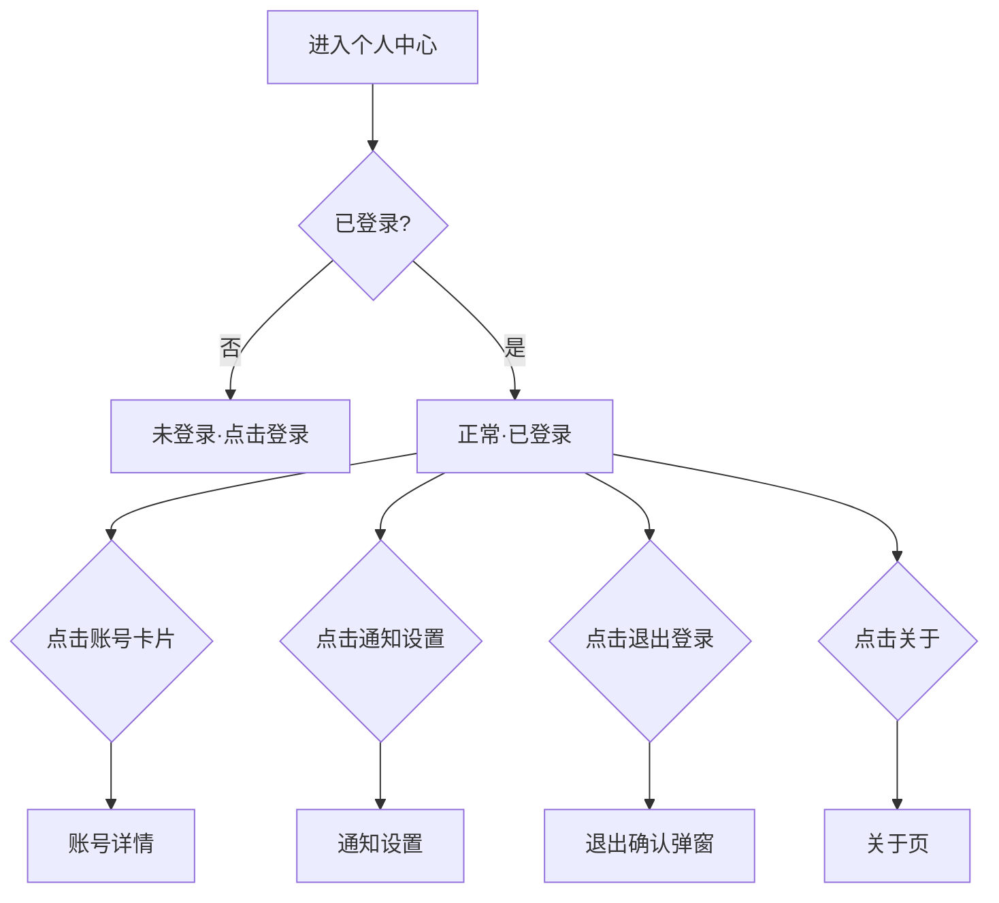

# 睡眠音响 PRD v8 - 个人中心

> 版本：v8 | 日期：2026-06-03 | 阶段：D 模块细化 | 模块：个人中心

---

## 个人中心 · 功能描述

### 页面定位

从底部导航「我的」进入。集账号管理、音响品牌展示、设置于一体。**这是音响品牌露出的核心页**。

> **账号数据来源**：头像、昵称来自账号体系（v10），第三方登录（Apple ID）时自动获取用户信息，支持手动修改。

### 页面布局（可滚动）

```
┌─────────────────────────────┐
│  我的                        │
├─────────────────────────────┤
│                             │
│  ┌─ 账号 ───────────────┐   │
│  │ 👤 头像  用户昵称     │   │
│  │      ID: 123456789   │   │  ← 账号卡片，点击进入账号管理
│  │                      │   │
│  │  累计追踪 127 晚      │   │
│  │  [编辑资料 →]        │   │
│  └──────────────────────┘   │
│                             │
│  ───────────────────────    │
│                             │
│  ┌─ 我的音响 ───────────┐   │  ← 品牌展示区
│  │                      │   │
│  │  [音响产品图/渲染图]  │   │
│  │                      │   │
│  │  🌙 睡眠音响 Pro     │   │
│  │  白噪音 · 助眠音效   │   │
│  │  · 智能定时         │   │
│  │                      │   │
│  │  [查看使用指南 →]    │   │
│  │  [了解更多产品 →]    │   │
│  │                      │   │
│  └──────────────────────┘   │
│                             │
│  ───────────────────────    │
│                             │
│  设置                       │
│  ┌──────────────────────┐   │
│  │ 同步提醒        [开关] │   │  ← 每日 8:00 提醒
│  │ 改善提醒        [开关] │   │  ← 每日 21:00 提醒
│  │ 通知设置         >    │   │
│  │ 隐私政策         >    │   │
│  │ 用户协议         >    │   │
│  │ 关于             >    │   │
│  └──────────────────────┘   │
│                             │
│  ───────────────────────    │
│                             │
│  ┌─ 账号安全 ───────────┐   │
│  │ 修改密码         >    │   │
│  │ 注销账号         >    │   │  ← 新增：跳转v10注销流程
│  └──────────────────────┘   │
│                             │
│  ───────────────────────    │
│                             │
│        退出登录             │
│                             │
├─────────────────────────────┤
│  🏠首页  📊趋势  💡改善  👤我的 │
└─────────────────────────────┘
```

### 各区域功能说明

| 区域 | 内容 | 交互 |
|------|------|------|
| **账号卡片** | 头像、昵称、ID、累计追踪天数（按自然日去重，同一天多设备数据只计1晚） | 点击进入账号详情（修改头像/昵称、账号安全） |
| **音响品牌展示区** | 音响产品图 + 名称 + 卖点简述 + 两个入口 | 产品图占视觉重心，体现品牌调性 |
| **使用指南** | 跳转音响使用说明（图文/视频） | 点击打开 WebView 或本地帮助页 |
| **了解更多产品** | 品牌其他产品展示/购买入口 | 点击跳转品牌官网或商城 |
| **设置列表** | 同步提醒开关、改善提醒开关、通知、隐私、协议、关于 | 开关即时生效，其他跳转子页 |
| **账号安全** | 修改密码、注销账号 | 跳转对应子页面 |
| **退出登录** | 退出当前账号（保留本地数据） | 二次确认弹窗，确认后跳转登录页 |

---

## 交互流程



---

## 状态判定



### 页面跳转

| 点击区域 | 目标 |
|----------|------|
| 账号卡片 | 账号详情 |
| 编辑资料 | 账号详情 |
| 使用指南 | WebView/帮助页 |
| 了解更多产品 | 品牌官网 |
| 通知设置 | 通知设置页 |
| 隐私政策/用户协议 | 文本页 |
| 关于 | 关于页 |
| 退出登录 | 退出确认弹窗 |
| 底栏·我的 | 当前页（高亮） |
| 底栏·首页/趋势/改善 | 对应页面 |

### 原型实现

- 5 页，layout:"vertical", padding:[46,16,16,16], gap:16
- 映射：`i6MQg`(正常), `KQl1O`(账号详情), `wKM7A`(通知设置), `nlpwd`(退出确认), `AwWlX`(关于)

---
