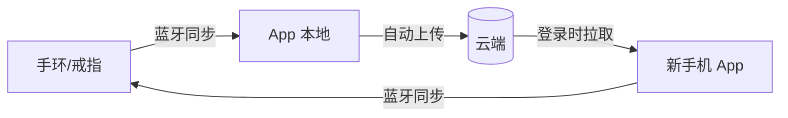

# 睡眠音响 PRD v9 - 云端同步

> 版本：v9 | 日期：2026-06-03 | 阶段：D 模块细化 | 模块：云端同步（追加）

---

## 云端同步 · 功能描述

### 核心原则

> **蓝牙同步完成后，自动上传云端。换手机登录后，自动拉回全部历史数据。全程无感。**

### 数据流全景

### 触发机制

| 阶段 | 触发条件 | 行为 |
|------|----------|------|
| **上传** | 每次蓝牙同步成功后 | 增量上传新增记录至云端，后台静默执行 |
| **下载** | 账号登录成功 / App 进入前台 | 比对云端与本地数据，拉取本地缺失的记录 |
| **重试** | 上传/下载因网络失败 | 自动重试，最多 3 次，均失败则本地标记待上传 |

### 冲突处理

| 场景 | 规则 |
|------|------|
| 同一条记录云端和本地都有 | 以时间戳为准，最新的保留 |
| 换手机后首次登录 | 先拉取全部云端数据，再连接设备同步增量 |
| 多设备同时上传同一晚数据 | 以设备时间戳为准，后到的覆盖先到 |
| 云端数据比设备还新 | 云端为准，设备端该条记录跳过 |

### 用户感知点

| 场景 | 感知方式 |
|------|----------|
| 上传中 | 无感知，后台静默 |
| 上传失败 | 首页顶部橙色小字："数据未备份到云端，连接网络后自动重试" |
| 新手机拉取中 | 首页顶部转圈 + "正在恢复历史数据…"，可正常浏览已有数据 |
| 全部完成 | 无感知 |

---

## 页面状态补充（追加到首页 / v3）

| 状态 | 触发条件 | 界面表现 |
|------|----------|----------|
| **云端备份失败** | 上传 3 次均失败 | 首页顶部橙色提示"数据未备份到云端，连接网络后自动重试" |
| **拉取历史数据中** | 新设备登录后首次启动 | 首页顶部转圈"正在恢复历史数据…"，逐条落库，首页数据随掉落刷新 |
| **云端数据不全** | 云端只有部分历史（因设备>7天未连丢失） | 不额外提示，仅展示云端已有的数据 |
| **拉取完成** | 全部历史数据恢复 | 无提示，首页正常展示 |

---

## 数据安全与隐私

| 维度 | 策略 |
|------|------|
| **上传内容** | 仅上传睡眠指标数值（评分、时长、分期占比、心率血氧均值和范围），不上传原始秒级波形数据 |
| **传输加密** | HTTPS |
| **账号绑定** | 数据与账号强绑定，退出登录后本地数据清除，云端保留 |
| **注销** | 注销账号时云端数据同步删除，不可恢复 |

---

*云端同步模块完成。阶段 D 全部 8 个模块细化完毕。*
